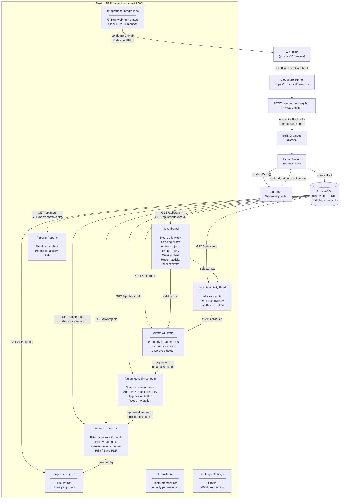
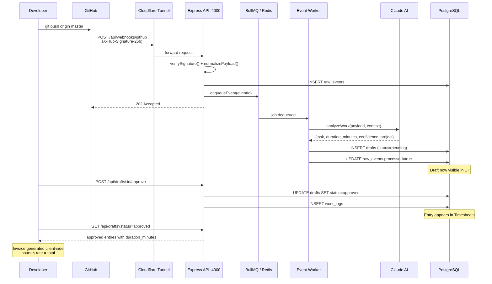

# FlowTrack AI — Architecture Diagram

## Frontend Pages & Relationships



## Data Flow: GitHub Push → Invoice



## Page Dependency Map

```
GitHub ──webhook──► Activity Feed ──generates──► AI Drafts
                                                      │
                                               approve / reject
                                                      │
                                                  Timesheets ──approve week──► Invoices
                                                      │                            │
                                                  work_logs                   project filter
                                                      │                            │
                                                   Reports ◄────────── Projects ◄─┘
                                                      │
                                                  Dashboard (summary of all above)
```

## Tech Stack Quick Reference

| Layer | Technology |
|-------|-----------|
| Frontend | Next.js 15, React 19, TypeScript, Tailwind v4 |
| UI components | shadcn/ui, framer-motion, lucide-react, recharts |
| Backend API | Express 5, TypeScript, ts-node-dev |
| Job queue | BullMQ + Redis 7 |
| Database | PostgreSQL 16 |
| AI analysis | Anthropic Claude (claude-sonnet-4-6) |
| Webhook tunnel | Cloudflare Quick Tunnel (cloudflared.exe) |
| Source control | GitHub (webhook ID 628631078 on GerhardAgile99/TimeBridge) |
